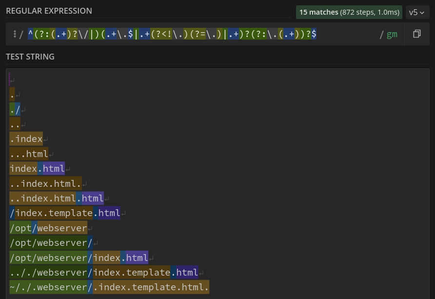

## About

`^(?>(.+)?\/|)((?>.+)(?<=\.)|.+(?<!\.)(?=\.)|.+)?(?:\.(.+))?$`

Regex that cuts a resource path into its components.
- Robust: handles edge cases (screenshot).
- Efficient: 15~90 steps, long and short paths ~equal time.

https://regex101.com/r/8aBZDd/4

    

